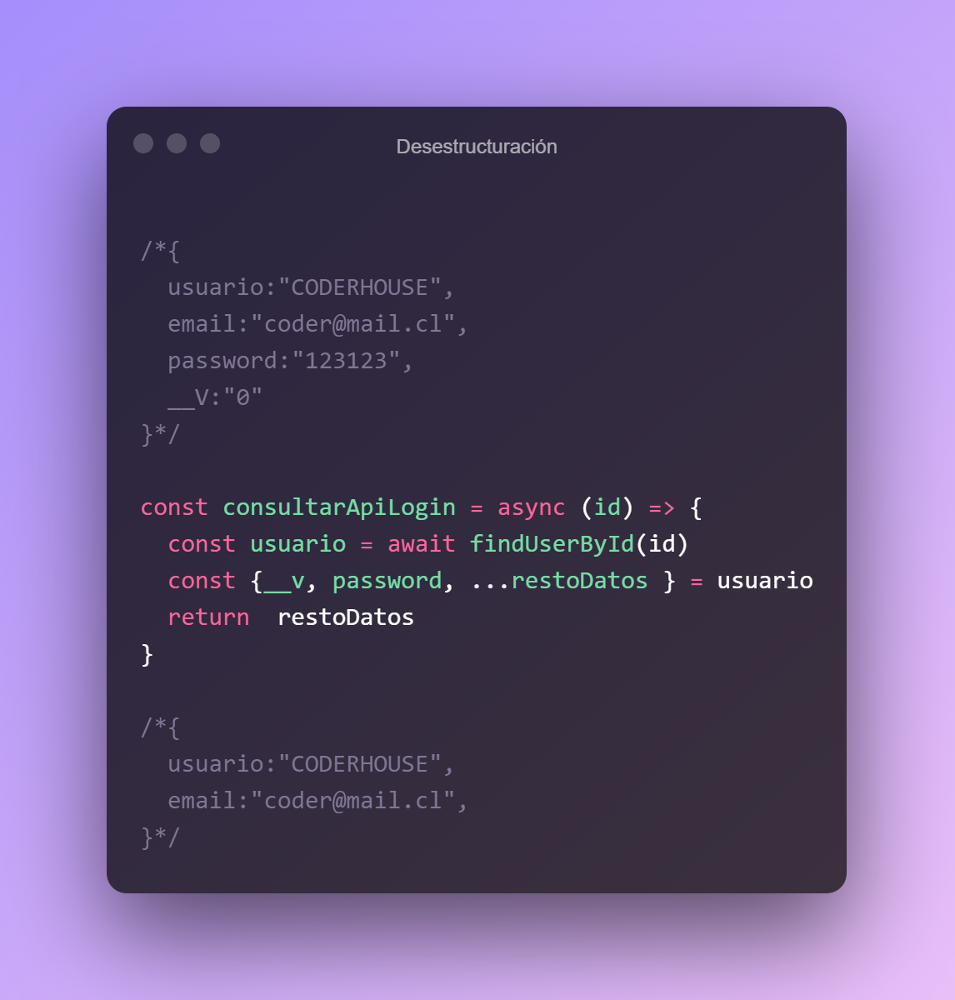

# Sintaxis ES6 

## Operador spread
El operador spread permite simplificar las concatenaciones de arrays y el empleo de estos elementos como parámetros. Para estudiar su funcionamiento comparemos el uso de la notación spread frente a una concatenación de arrays empleando el método concat.


otro ejemplo de uso de spread


## Parametros Rest 

La sintaxis de los parámetros rest nos permiten representar un número indefinido de argumentos como un array.


## Desestructuración
La desestructuración es una característica muy conveniente al desarrollar con javascript, es una expresión que nos permite desempaquetar valores de arrays u objetos en grupos de variables, permitiéndonos simplificar y crear código más legible.





# Métodos de Array 
## ForEach
El forEach es un metodo para iterar cada elemento de un array y ejecutar una funcion.

```js 

const data = ["React", "Angular", "Vue"]

data.forEach(()=> {
    
})

```


## Reduce